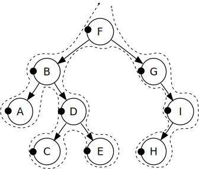

# Tree

## Instructions

[Problem files](.) Implement [Tree](https://en.wikipedia.org/wiki/Tree_(data_structure)) data structure together with `Breath-First` and
`Depth-First` traversals. This is quite big problem, so we will split it into multiple steps.

## Steps

### 1. `Node` implementation

* **Description**: Implement a `Node` class. The constructor should accept an argument that gets assigned to the data property and initialize
  an empty list for storing children. The `Node` class should have `add` and `remove` methods to add/remove the child node.
* **Test**: `create Node with abc data`,
            `Node can add children`,
            `Node can remove children`

Example:

```
val node = Node("abc")
node.data // "abc"
node.children.size // 0
```

Example 2:

```
val node = Node("a")
node.add("b")
node.children.size // 1
node.remove("b")
node.children.size // 0
```

### 2. `Tree` implementation

* **Description**: Implement a `Tree` class. The `Tree` class should have `add` and `remove` methods to add/remove the child node.
* **Test**: `Tree is empty`

Example:

```
val tree = Tree("abc")
tree.root // null
tree.root = Node("A")
```

### 3. Breath First traversal (BF traversal)

* **Description**: Implement breath-first traversal - traversal, where we visit every node on a level before going to a lower
  level.
* **Test**: `breath first traverse`

Example:


### 4. Depth First traversal (BF traversal)

* **Description**: Implement depth-first traversal - traversal, where we visit node and then all of it's children before visiting next
  node.
* **Test**: `depth first traverse`

Example:


