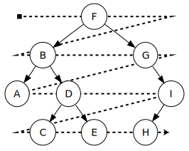

# Tree traversal

## Nice to solve before

[Queue](../../../../queue/basic/README.md)

## Instructions

Traverse [tree](https://en.wikipedia.org/wiki/Tree_(data_structure)) using `Breath-First` traversal.

Implement breath-first traversal - visit every node on a level before going to a lower level.



## Examples

```kotlin
// ---------Tree------------
//
//           A
//         /   \
//        B     C
//
// --------------------------


val tree = BinarySearchTree<Char>()
tree.add('A')
tree.add('B')
tree.add('C')

tree.traverseBreathFirst() // listOf('A', 'B', 'C')
```

