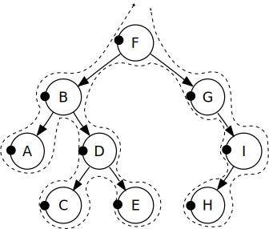
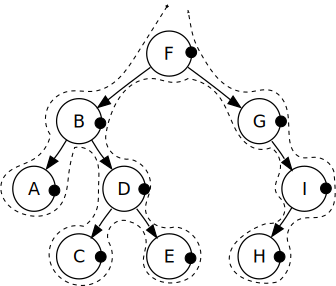

# Tree traversal

## Nice to solve before

[Stack](../../../../stack/basic/README.md)

## Instructions

Traverse [tree](https://en.wikipedia.org/wiki/Tree_(data_structure)) using `Depth-First` traversal.

### Pre Order Depth First traversal

Algorithm:
- Visit the node 
- Traverse entire left side
- Traverse entire right side

Result: `F B A D C E G I H`

Test: `traverse depth first pre order`

### In Order Depth First traversal

Algorithm:
- Traverse entire left side
- Visit the node 
- Traverse entire right side

Result: `A B C D E F G H I`

Test: `traverse depth first in order`

### Post Order Depth First traversal

Algorithm:
- Traverse entire left side
- Traverse entire right side
- Visit the node 

Result: `A C E D B H I G F`

Test: `traverse depth first pre order reversed`

### Pre Order Depth First traversal reversed

Algorithm:
- Visit the node 
- Traverse entire right side
- Traverse entire left side

Result: `F G I H B D E C A`

Test: `traverse depth first pre order reversed`

### In Order Depth First traversal reversed

Algorithm:
- Traverse entire right side
- Visit the node 
- Traverse entire left side

Result: `I H G F E D C B A`

Test: `traverse depth first in order reversed`

### Post Order Depth First traversal reversed

Algorithm:
- Traverse entire right side
- Traverse entire left side
- Visit the node 

Result: `H I G E C D A B F`

Test: `traverse depth first pre order reversed`

